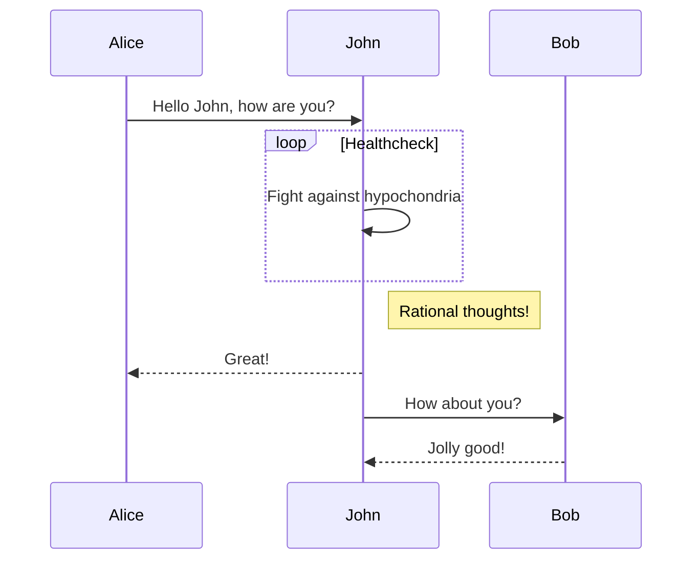

# Backstage As Devops

How to setup Backstage with DevOps in mind.

Viva DevoPs

## What is Gianfragolo Developer Portal ?

An Engineering portal for APIs, events and reusable assets to enhance developer experience.

Gianfragolo Developer Portal is powered by Backstage, with few enhancements and additional plugins built.

Backstage is an open platform for building developer portals. Backstage unifies all infrastructure tooling, services, and documentation to create a streamlined development environment from end to end.

## List Domains & Systems

[Domains](https://doh22-backstage-dockerapp.azurewebsites.net/catalog?filters%5Bkind%5D=domain&filters%5Buser%5D=owned)

[Systems](https://doh22-backstage-dockerapp.azurewebsites.net/catalog?filters%5Bkind%5D=system&filters%5Buser%5D=owned)

[View Domain Operations](https://doh22-backstage-dockerapp.azurewebsites.net/catalog-graph?rootEntityRefs%5B%5D=domain%3Adefault%2Foperations&maxDepth=2&selectedKinds%5B%5D=domain&selectedKinds%5B%5D=group&selectedKinds%5B%5D=system&selectedKinds%5B%5D=user&unidirectional=true&mergeRelations=false&direction=TB&showFilters=true)

[View Domain Payments](https://doh22-backstage-dockerapp.azurewebsites.net/catalog-graph?rootEntityRefs%5B%5D=domain%3Adefault%2Fpayments&maxDepth=2&selectedKinds%5B%5D=domain&selectedKinds%5B%5D=group&selectedKinds%5B%5D=system&selectedKinds%5B%5D=user&unidirectional=true&mergeRelations=false&direction=TB&showFilters=true)

## List Installed actions

[List Actions](https://doh22-backstage-dockerapp.azurewebsites.net/create/actions)

## Setup Application

* npx @backstage/create-app
* cd app && yarn dev
* Add Github Discovery
  * yarn add --cwd packages/backend @backstage/plugin-catalog-backend-module-github
* Add Roadie Github PR
  * yarn add --cwd packages/app @roadiehq/backstage-plugin-github-pull-requests
* Add Roadie Github Insights
  * yarn add --cwd packages/app @roadiehq/backstage-plugin-github-insights
* Add K8s plugin
  * yarn add --cwd packages/app @backstage/plugin-kubernetes
  * yarn add --cwd packages/backend @backstage/plugin-kubernetes-backend
* Add Home Plugin
  * yarn add --cwd packages/app @backstage/plugin-home
* Add ADR Plugin
  * yarn --cwd packages/backend add @backstage/plugin-adr-backend

### Mermaid section

